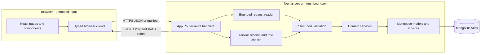
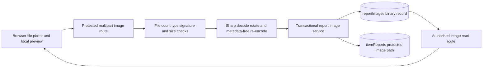
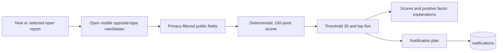

# Campus Find System Architecture

Campus Find is a single Next.js full-stack application. The code is separated
into browser UI, HTTP trust boundaries, domain services, and persistence so each
layer has a clear course-demonstration responsibility.

## Main request flow

The browser never connects directly to MongoDB. Route handlers establish the
HTTP boundary, limit request size, retrieve the server-side session, enforce the
required account role/status, and validate untrusted data. Services implement
transactions and business rules. Mongoose schemas add persistence validation,
indexes, and safe field-selection defaults.

## Report image flow

JPEG, PNG, and WebP images are limited to five per report and 3 MiB stored bytes
each. Sharp decodes and re-encodes them without EXIF metadata. The transaction
stores the protected binary record and appends its internal API path to the
report. Ordinary pages receive the path, not raw database access.

## Explainable matching and notification flow

Matching uses category, optional public location/date, colours, tags, and public
text. It does not use verification answers, reporter identity, contact data, or
private location detail. When a newly submitted report creates a strong
opposite-type possibility, notification plans are committed with the same
business transaction. The scorer remains advisory; Claim verification decides
whether recovery may proceed.

## Security and reliability boundaries

- Sessions use random cookie tokens while only token hashes are stored.
- Passwords use salted key derivation and are never stored in plain text.
- Authentication and selected mutation routes have bounded process-local rate
  limits suitable for the assessed single-instance deployment.
- JSON bodies use a shared 16 KiB strict UTF-8 reader; oversized requests return
  HTTP 413.
- Route error mappers return stable safe messages rather than raw database or
  validation internals.
- Multi-document report, Claim, image, moderation, and account operations use
  MongoDB transactions where atomicity is required.
- Tests mock database access; automated tests and production builds do not
  connect to Atlas.

## Technology map

| Concern | Implementation |
| --- | --- |
| UI and routing | Next.js App Router, React, TypeScript |
| Styling and responsive layout | CSS Modules, Tailwind/PostCSS base tooling |
| Browser/server contracts | Zod and explicit public DTO builders |
| Authentication | Revocable HTTP-only cookie sessions, Node.js crypto |
| Domain logic | TypeScript service modules |
| Persistence | MongoDB Atlas and Mongoose |
| Image processing | Sharp |
| Intelligent recommendation | Local deterministic weighted scorer |
| Automated quality | Vitest, Testing Library, ESLint, TypeScript, Next build |

## Source layout

- `web/src/app`: pages and route handlers.
- `web/src/components`: role-oriented React UI.
- `web/src/lib`: browser contracts, validation, services, security utilities,
  and the matcher.
- `web/src/models`: Mongoose schemas, relationships, indexes, and protected
  field defaults.
- `web/scripts`: explicit database setup and audit commands.
- `docs`: course-facing architecture, evaluation, verification, and user
  guidance.
