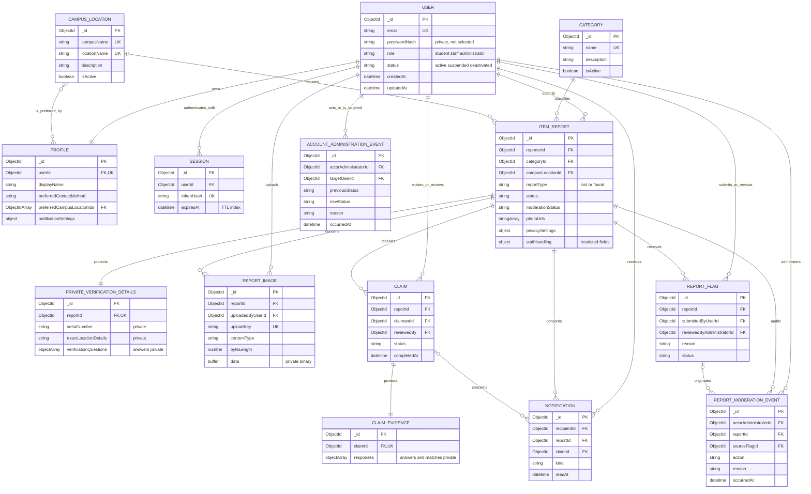

# Campus Find Database ERD

This diagram reflects the Mongoose models currently implemented in
`web/src/models`. MongoDB does not enforce relational foreign keys, but ObjectId
references and service-layer checks provide the relationships shown here.

## Keys, constraints, and indexes

- User email, session token hash, profile user ID, private-verification report
  ID, and Claim-evidence Claim ID are unique.
- Category names are unique with case-insensitive English collation. Campus
  location pairs (`campusName`, `locationName`) use the same case-insensitive
  uniqueness rule.
- Reports are indexed for owner history, type/status/category/date searches,
  location/status/date searches, and weighted text search.
- Sessions have a TTL index on `expiresAt`, so MongoDB can remove expired
  sessions.
- Report-image upload keys are unique within a report, making upload retries
  idempotent.
- A partial unique report-flag index prevents the same user from holding more
  than one pending flag for the same report.
- Audit events are indexed by target/report and administrator with descending
  occurrence time.

## Historical reference policy

Categories and campus locations are deactivated rather than deleted. Existing
reports keep their ObjectId references, so historical records remain readable
while inactive reference data is excluded from new-report choices.

## Privacy boundary

`ITEM_REPORT` contains the public discovery fields and explicit privacy
settings. Ownership answers, serial numbers, and exact private locations are
stored separately in `PRIVATE_VERIFICATION_DETAILS`; submitted Claim answers
are stored separately in `CLAIM_EVIDENCE`. Sensitive fields use `select: false`
and are accessed only by the service operations that require them. Report image
binary data and uploader/upload-key fields are likewise not returned by ordinary
report queries.
